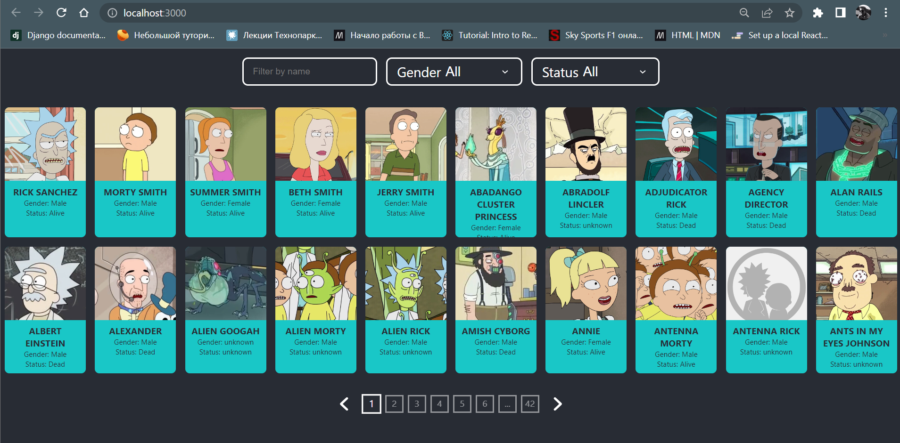
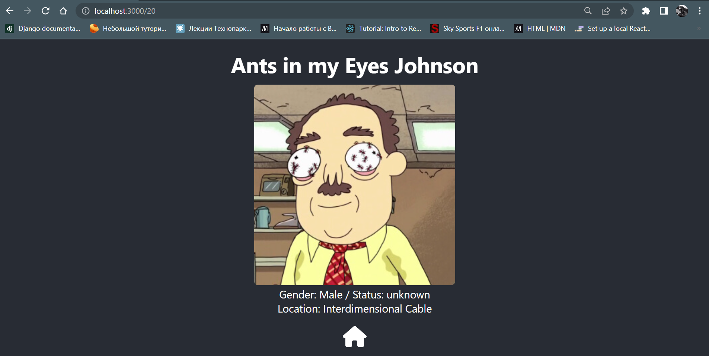

# Rick and Morty characters list

## Description
This is test React application made by [me](https://www.facebook.com/profile.php?id=100016030623493) needed for test 
tech interview.
The goal of this app is to prove my abilities to work with REST API,
React-router, react context.

This app gets data from [Rick and Morty API](https://rickandmortyapi.com/) 
and render it on the screen. There are more than 800 characters provided by 
this API. This API provides pagination and filtering. 
You can filter characters by name, status (dead/alive) and gender.

If you click on character you will open the single character page which
contains a bit more information about the character and home icon.
You can also input single character ID into url thanks to React-Router. To
go back to all characters you can press home icon or go back button in your
browser.

[//]: # (To manage states I use React-Context, but I am going to use Redux in the )

[//]: # (future. There is so much work can be done! )

[//]: # (For example:)

[//]: # (- adding characters to favorites list)

[//]: # (- add an ability to make your own character using local storage)

[//]: # (- improve routing )

[//]: # ()
[//]: # (This project is improving by me all the time. If you want to add anything )

[//]: # (here to pump up your skills you are welcome!)
